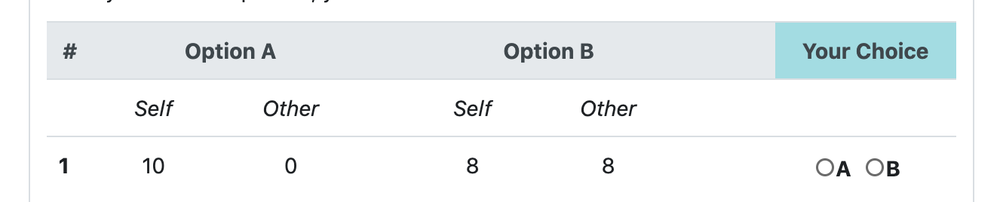
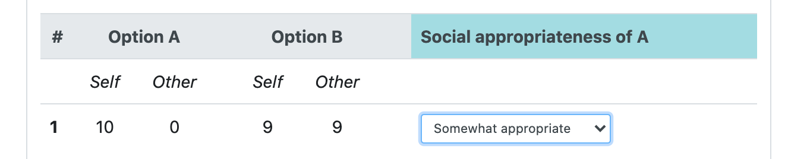

# Modified Dictator Game + Social Norms

## oTree software

The software is developed in [oTree](https://www.otree.org/).
The experiment is made of two parts: 'mod_DG' and 'dict_KW'
The software does not compute the payoffs, they are computed offline by R

#### settings.py

> dict(
>'name': 'dict_social_norms',
>'display_name': "L_dict_social_norms",
>'num_demo_participants': 5,
>'app_sequence': ['mod_DG','dict_KW'], #possibility to add 'id' at the beginning and 'demo_questionnaire' at the end
>'language':"en"
>}

### Part 1 - Modified DG (mod_DG)

A modified dictator game following

Blanco, M., Engelmann, D., & Normann, H. T. (2011). A within-subject analysis of other-regarding preferences. Games and Economic Behavior, 72(2), 321-338.

#### [models.py](./mod_DG/models.py)

> class Constants(BaseConstants):
>    name_in_url = 'mod_DG'
>    players_per_group = None
>    num_rounds = 1
>    A_own = 10
>    A_other = 0
>    payout_KW=5

#### [pages.py](./mod_DG/pages.py)

page_sequence = [Instructions, MPL]

### Part 2 - Social norms

A coordination game to elicit social norms following

Krupka, E. L., & Weber, R. A. (2013). Identifying social norms using coordination games: Why does dictator game sharing vary?. Journal of the European Economic Association, 11(3), 495-524.

#### [models.py](./mod_DG/models.py)

> class Constants(BaseConstants):
>    name_in_url = 'dict_KW'
>    players_per_group = None
>    num_rounds = 1
>    A_own = 10
>    A_other = 0
>    payout_KW=5
>    import random
>    rdm_row = random.randint(0,10) #which choice is chosen, same for all

control the values of column A for own and other

#### [pages.py](./mod_DG/pages.py)

page_sequence = [Instructions, Choices]

## Output Analysis

The RMarkdown file that generates an analysis of the output can be found in [mod_DG.Rmd](./DATA/mod_DG.Rmd)
