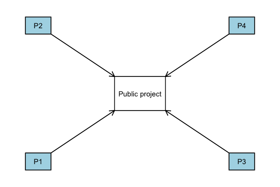
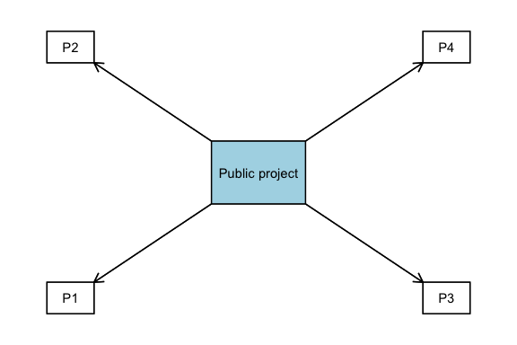

# PGG_lecture

## oTree software

The software is developed in [oTree](https://www.otree.org/) to manage a 4-player linear voluntary contribution game (aka Public Goods Game).

### Main parameters

#### settings.py

>     dict(
>        name='PGG',
>        display_name=PGG",
>        num_demo_participants=12,
>        app_sequence=['PGG_lecture'],
>        treatment="VC"
>    )

treatment can  be either **"VC"** and we get a classic voluntary contribution or can be **"CP"** and we get a common pool game.

##### VC

##### CP

#### [models.py](./models.py)

> class Constants(BaseConstants):
>    name_in_url = 'PGG'
>    players_per_group = 4
>    num_rounds = 10
>    endowment = c(100)
>    multiplier = 2

You can control
- players per group
  - *players_per_group*
- the number of rounds
  - *num_rounds*
- initial endowment in each round
  - *endowment*
- multiplier of the public project (distributed as multiplier/N)
  - *multiplier*

#### [pages.py](./pages.py)

page_sequence = [Instructions, Contribute, ResultsWaitPage, Results, FinalResults]

## Output Analysis

The RMarkdown file that generates an analysis of the output can be found in [PGG.Rmd](./DATA/PGG.Rmd)
