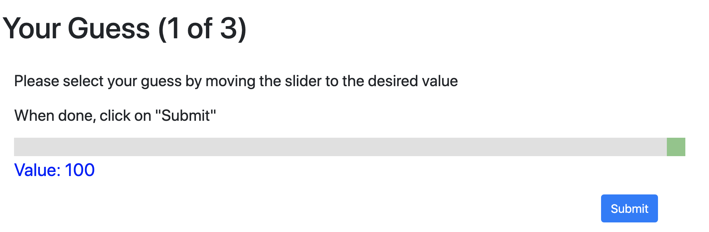
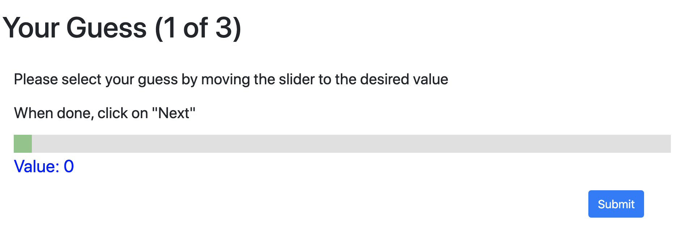

# Beauty Contest

## oTree software

The software is developed in [oTree](https://www.otree.org/) to manage a "beauty contest game": guess 2/3 of the average number reported by the others. Participants choose with a slider.

### Treatments

Participants are randomly assigned to two alternative conditions

- Default 100
  - The starting value in the slider is 100
    - 
- Default 0
  - The starting value in the slider is 0
    - 

### Main parameters

#### settings.py

dict(
    name='beauty',
    display_name="Beauty",
    num_demo_participants=3,
    app_sequence=['beauty_contest'],
),

#### [models.py](./models.py)

> class Constants(BaseConstants):
>    players_per_group = None
>    num_rounds = 3
>    name_in_url = 'beauty_contest'
>    jackpot = Currency(100)
>    guess_max = 100

You can control
- number of rounds
  - *num_rounds*
- range of guesses
  - *guess_max*
- Earnings
  - *jackpot*

#### [pages.py](./pages.py)

page_sequence = [Instructions, Guess, ResultsWaitPage, Results, FinalResults]

## Output Analysis

The RMarkdown file that generates an analysis of the output can be found in [beauty_contest.Rmd](./DATA/beauty_contest.Rmd)
